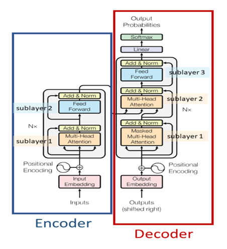

# Emotion Classification Using Self Attention.

Paper proposed by <b> Google Brain & Google Research </b> on Attention is all you need. The paper suggest we can replace RNN, LSTM and used only attention and dense
layer for doing task related to NLP. The paper also talk about the draw back of RNN family algorithm and how their approach overcome those drawback. Link to the paper is :- https://arxiv.org/pdf/1706.03762.pdf

  
<h3> Task. </h3>
In this work, I used encoder archtiecture from the paper Attention is all you need to train a model that can classify the emotion for given task.
<h3> Installation. </h3>
<ul>
  <li> Python==3.6.6</li>
  <li> Pytorch==1.6.0</li>
 </ul>
<h4> Architecture. </h4>
I used encoder architecture from paper <b> Attention is all you need </b> which is shown in given image:- 
<figure>

  </figure>
